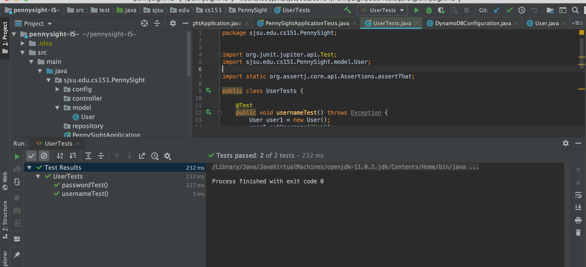

# PennySight - Path Towards Financial Freedom

## Sections
- [Overview](#overview)
- [Team](#team)
- [App Evaluation](#app-evaluation)
- [Product Specs](#product-specs)

---

## Overview
PennySight is a Java Spring web-based application that helps individuals keep track of their finances. It lets users visualize and read both in numbers and charts about their spending habits. The app having the ability and integration of AI and Image Analysis, it provides users with financial advice based on the data provided. 

At PennySight we strive to provide a helping hand in bringing Financial Freedom in your life. With practical and valueable advice and steady improvements in budgeting we beleive that one can be on their track to achive their financial dreams.

Learn More about PennySight's vision at: www.pennysight.com

--- 

## Team
This application was built by a group of three students from San Jose State Univserity while pursing their CS151 - Object Oriented Programming Course. As a group we all have worked on every part of the app from front-end to back-end but each person has shown their experties in a particular area. 

#### Abhay Naik
Abhay is the team lead, application designer, and front-end developer of project PennySight. He is currently pursing his Bachelor's of Science degree in Management Information Systems (MIS) and also a Computer Science Minor.
#### Shyla Subrahmanya 
Shyla holds a critical role in application desgin as well in the front-end development. She is currently pursing her Bachelor's of Science degree in Software Engineering. 
#### Wangcheng Yuan
Wangcheng is the brain towards the back-end development of PennySight. He is currently pursing his Master's degree in Computer Science. 

---

##
## App Evaluation

- **Category:** Personal Finance

- **Web-Application:** This app is developed currently for a Web platform but it has the versatility to be integrated into a Mobile based application.

- **Story:** Allows people to track their personal finances along with valuable advice that will help one be aware of their financial desisions and habits.

- **Market:** Made specifically for young adults but it works for anyone. The target market does not need to have a strong financial background.

- **Habit:** This app is focused towards using it on a monthly basis but the user can take away helpful information from the app and utilize it on a daily basis.

- **Scope:** This is app is personal so as the user continuously uses the app, they will further strengthen their knowledge of finance and eventually make sound decisions while becoming finacially literate.

---

## Product Specs

**Crtical Features:**
* [ ] User can Log In
* [ ] User can Sign Up
* [ ] User can Log Out
* [ ] User can enter personal financial data
* [ ] User can view their spending data
* [ ] User can view past spending data
* [ ] User have the ability the view numerical data as well as graphical data
* [ ] Users data is secure
* [ ] User can take a picture of their recipets and the system can analyze and record the data

**Additional Features:**
* [ ] The app can pull data from their bank/credit card account to automatically fill in their monthly spending expenses

**Unit test passed for the User class:**
